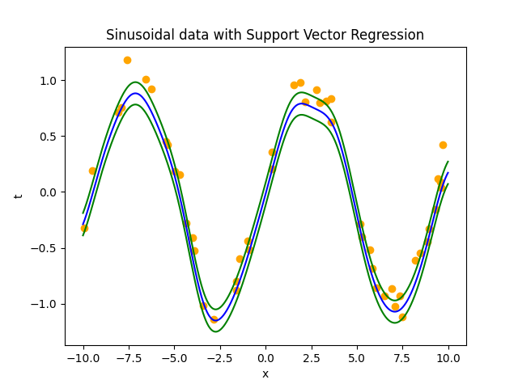

# Support Vector Regression

This repository contains the code implementation of Support Vector Regression on a synthetic sinusoidal dataset



The derivation for Support Vector Machine is available in the post [blog](https://paperthatiread.com/index.php/2024/01/11/support-vector-machine-for-regression/).

## Run the code
1) Install the Python modules in ```requirements.txt```
2) Run the code in Jupyter Notebook